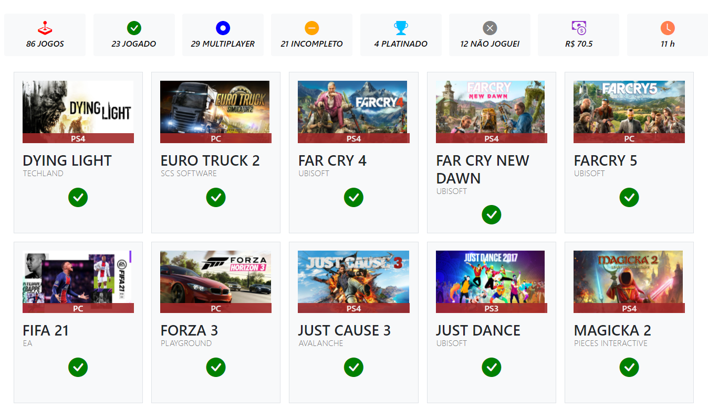

# 🎮 Seu Banco de dados de Jogos
## Apresentação

Sistema para cadastro e controle de seus jogos, onde você pode verificar quanto custa sua carteira, quanto tempo tem de jogo e etc. O sistema permite cadastro dos jogos, com as informações mais necessárias e possível edição do mesmo.  
<br>



## Instalação
### Requisitos:

``` 
- Servidor WEB VPS linux. É necessário que o apache, php e mysql estejam instalados e configurados corretamente. 
 ```
 
 ### Banco de dados:

 ``` 
 - Criação do banco de dados chamado "jogo";
 - Importação do arquivo "jogo.sql" dentro do banco de dados;
 ```


